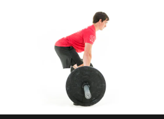
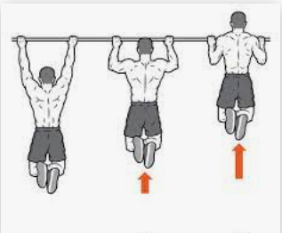
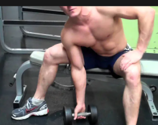
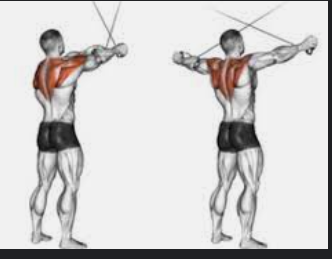

# My Back&Bicep Menu

| \- Menu                  | Weight            |   Remarks  |
| --------------------------------------- | ------------- | --------------|
| \- Barbell Rows (3x10)                  | 8.65 kg each side            | Bar 高さ14、Saftyバー18, replacement: Standing Band Row 8 height 87 kg|
| \- Deadlifts (2x5)                      | 20kg  each   |  バー高さ15, No safety bar| 
| \- Pullups (3x8)                        | body weight+0 | N/A |
| \- EZ bar biceps curls (standing) (3x8) | 3.75+3.75     | N/A |
| \- Dumbbell Rows (2x9)                  | 16 per hand   | N/A |
| \- Concentration curls (2x10)           | 8kg per hand  | N/A |
| \-CABLE Reverse Flyes(2x12)             | 21.8kg each side    | 高さ１

## How to images

-  Barbell Rows  (3x10)

- Deadlifts (2x5)

- Pullups (3x8)

- EZ bar biceps curls (standing) (3x8)

.png)

- Dumbbell Rows (2x9)

- Concentration curls (2x10)

-CABLE Reverse Flyes(2x12) 

