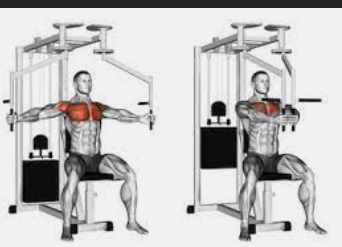
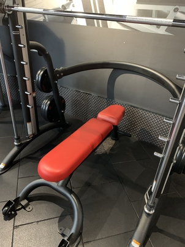
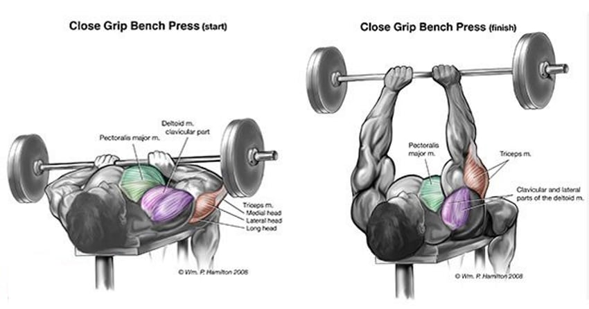

# My Chest & Triceps Menu

| \- Menu                  | Weight             | Joyfit24 machine setting info |
| ------------------------------------- | ---------------- | ------------------- |
| \- Barbell Incline Bench Press (3x10) | 10x10            | 11 バー高さ/サーフのやつは15   |
| \- Dips (4x7)                         | body weight+0    | 腰の機械で               |
| \- Pullovers (3x10)                   | 16kg             | NA                  |
| \- Skullcrushers (3x8)                | 3.75x3.75        | 2.5\*2.5            |
| \- Machine Flyes (3x9)                | 27.2kg each side | 6左右的高度 pulldownの機械で|
| \- -Decline Dumbbell Chest Fly (Machine Flyes Replacement)| 9+9kg dumbbell   | 椅子足乗せ部分を一段高くする |
| \- Triceps Pulldowns (2x13)           | 49kg             | NA |
| \- -Close Grip Bench Press (Triceps Pulldowns Replacement)   | 3.625 each side  | スミスマシンで椅子足乗せ部分を一段高くする |
| Option Shoulder ダンベル　(With Pullover   | 12x12            |                 |

## How to images

- Barbell Incline Bench Press (3x10)

- Dips (4x7)

- Pullovers (3x10)

- Skullcrushers (3x8)

- Machine Flyes (3x9)

- Triceps Pulldowns (2x13)

- Smith machine Chair

- Decline Dumbbell Chest Fly

- Close Grip Bench Press

Option Shoulder ダンベル　(With Pullover

