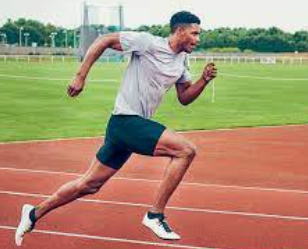
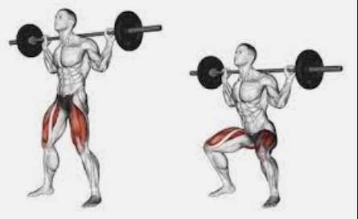
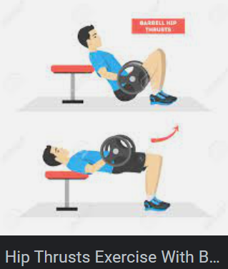

# My Legs Menu

| \- Menu                  | Weight             | Joyfit24 machine setting info |
| ------------------------------------- | ---------------- | ------------------- |
| \- Back squats (3x6)                       | 10+10        | バー高さ4  |
| \- Barbell Romanian Deadlifts (3x8)        | 15 each side | バー高さ13 |
| \- Front squats (3x8)                      | ?            | NA     |
| \- Calf / Leg press on legs machine (2x12) | ?            | NA     |
| \-One feet squats (2x7)                      | 9+9          | NA     |
| \- (optional) Hip thrusts (3x6)            | ?            | NA     |

## How to images

- Warm-up running (5 min)

- Back squats (3x6)

- Barbell Romanian Deadlifts (3x8)

- Front squats (3x8)

- Calf / Leg press on legs machine (2x12)

- One feet squats (2x7)

.png)

- (optional) Hip thrusts (3x6)

