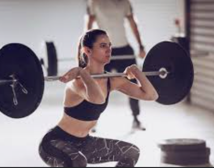
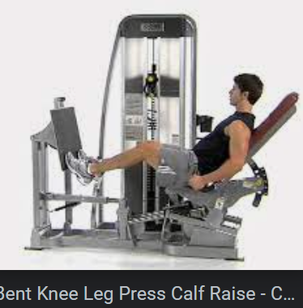

# My Legs Menu

| \- Menu                  | Weight             | Joyfit24 machine setting info |
| ------------------------------------- | ---------------- | ------------------- |
| \- Back squats (3x6)                       | 17.5 each side      | バー高さ4, safty bar 12  |
| \--- Leg Press Machine(4x10)                  | 99 - 108 kg  | バー高さ4, safty bar 12  |
| \- Barbell Romanian Deadlifts (3x8)        | 20 each side | バー高さ13 |
| \--- Leg extension machine (3x10)        | 27 kg | quadriceps muscle in the legs|
| \- Front squats (3x8)                      | 5+5 kg       | バー高さ5     |
| \--- Leg curl machine (3x10  | 27 kg       | hamstring muscles  |
| \- Calf / Leg press on legs machine (2x12) | 81kg         | NA     |
| \- One feet squats (2x7)                   | 9+9          | NA     |
| \- (optional) Hip thrusts (3x6)            | ?            | NA     |

## How to images

- Warm-up running (5 min)

- Back squats (3x6)

- Barbell Romanian Deadlifts (3x8)

- Front squats (3x8)

- Calf / Leg press on legs machine (2x12)

- One feet squats (2x7)

.png)

- (optional) Hip thrusts (3x6)

