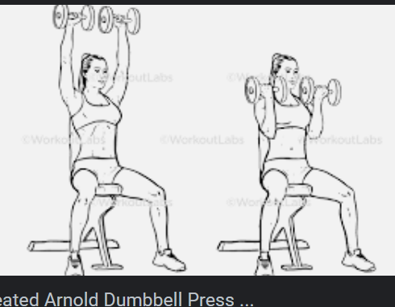
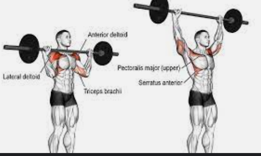
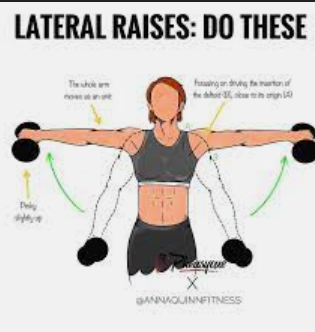
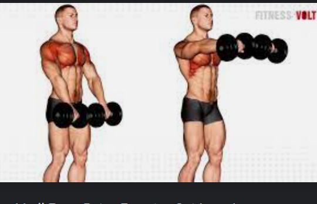
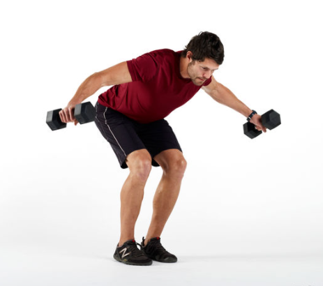
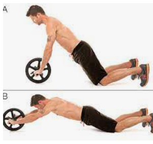
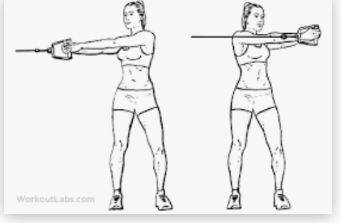
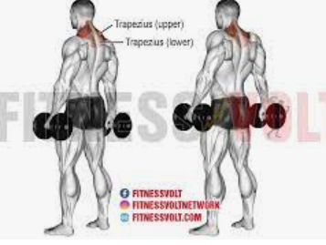

# My Shoulders, Abs, Forearms Menu

| \- Menu                  | Weight             | Joyfit24 machine setting info |
| ------------------------------------- | ---------------- | ------------------- |
| \- Seated Arnold Shoulder Press (3x8)          | 12KG each        | NA     |
| \- Overhead Press (3x6)                        | Only bar       | 高さ5段階に |
| \- - SUPERSET 1 - Lateral Raises (3x8)           | 4kg  each        | NA     |
| \- - SUPERSET 1 - Front Raises (3x8)             | 4kg each          | NA     |
| \- - SUPERSET 1 - Back Raises (3x9)              | 5 kg each         | NA     |
| \- Reverse Grip EZ-Bar Curls (3x8)             | 2.5x2.5kg      | NA     |
| \- - SUPERSET 2 - Ab rolls (2x15)                | NA             | NA     |
| \- - SUPERSET 2 - Core rotation (2x10 each side) | 32.7 each side | 高さ6   |
| \- Dumbbell Shrugs (3x10)                      | 20kg Each Side | NA     |

---

## How to images

- Seated Arnold Shoulder Press (3x8)

- Overhead Press (3x6)

- SUPERSET 1 - Lateral Raises  (3x8)

- SUPERSET 1 - Front Raises  (3x8)

- SUPERSET 1 - Back Raises (3x9)

- Reverse Grip EZ-Bar Curls (3x8)

.png)

- SUPERSET 2 - Ab rolls (2x15)

- SUPERSET 2 - Core rotation (2x10 each side)

- Dumbbell Shrugs (3x10)

